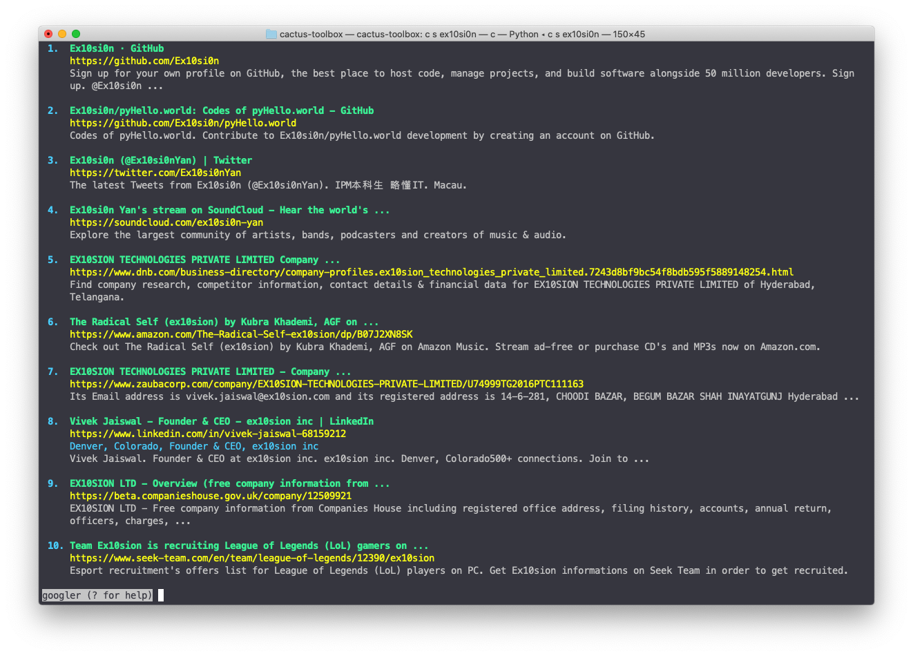
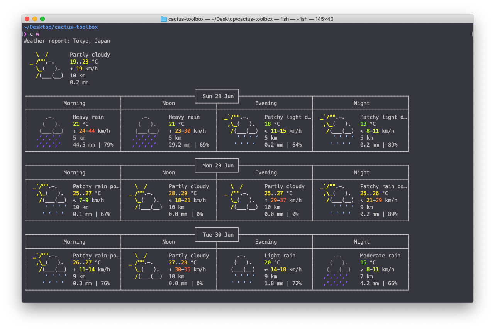
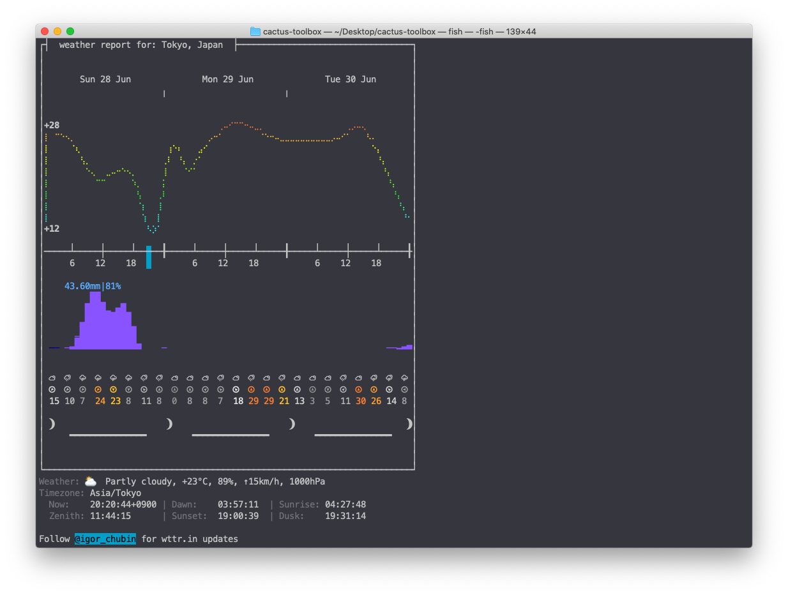
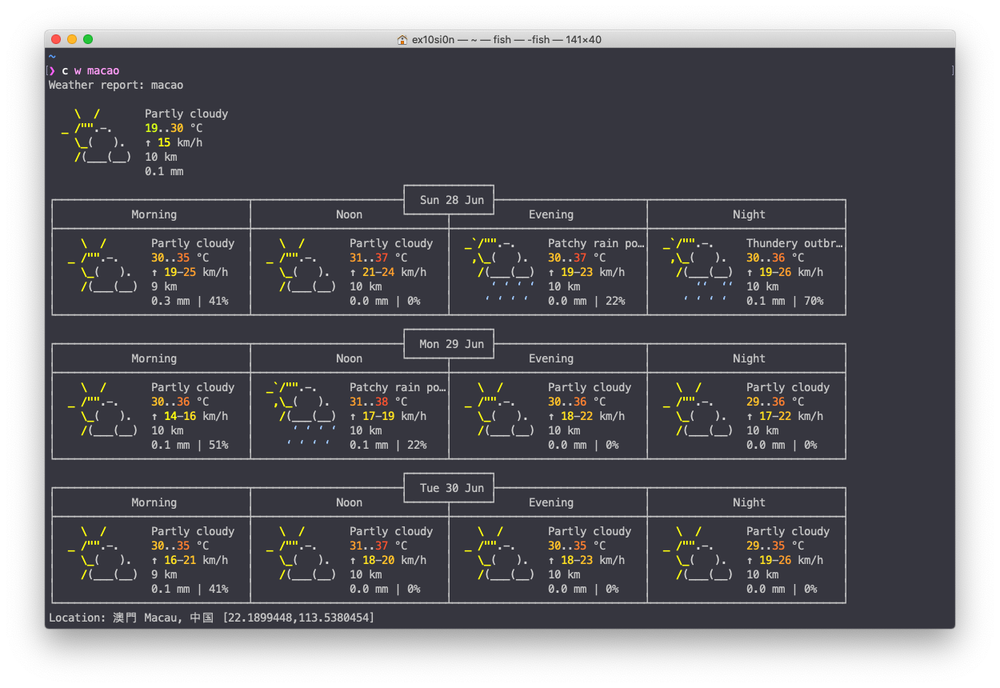
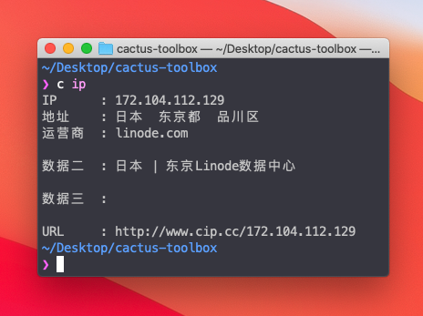
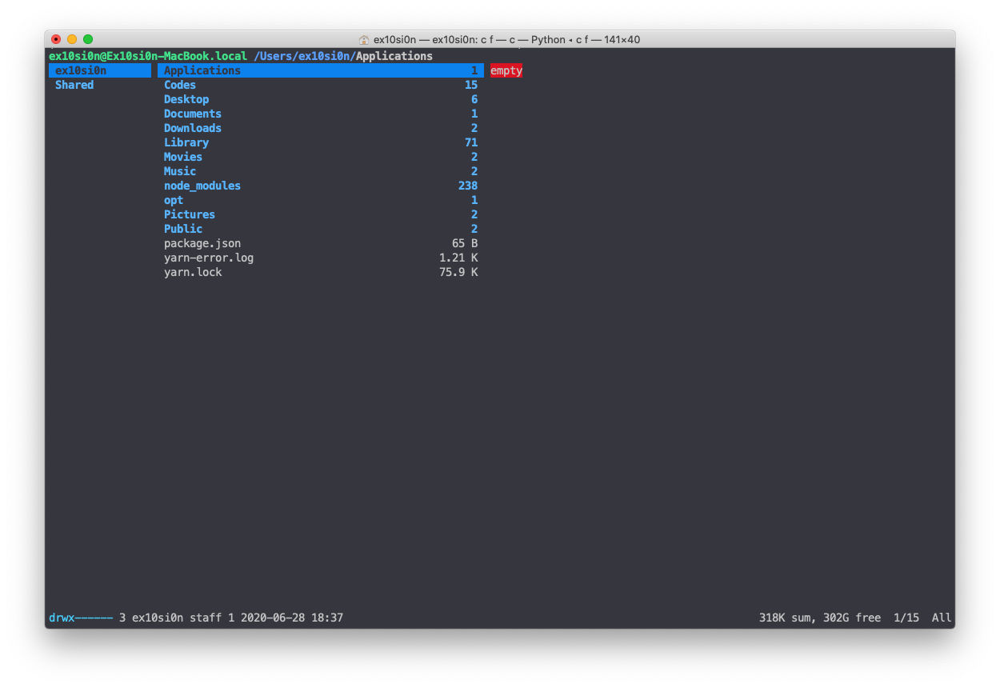
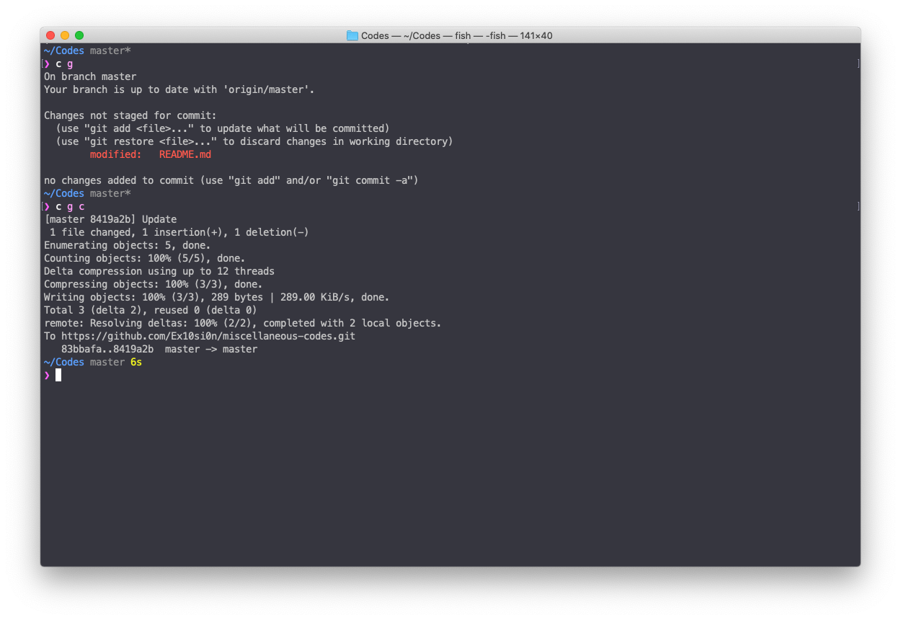

# Cactus-ToolBox

A Command Line ToolBox for macOS

by Ex10si0n

## Usage

```
Welcome to 🌵cactus-ToolBox by Ex10si0n.
Usage: 
  c <commands> [words]

Commands:
  [Browsing]
      s [text]              Search from Google.  Searching by googler
      w                     Display local Weather.
      w [city name]         Display Location Weather.  Weather by wttr.in
      ip                    Get Host/Proxy IP address.
      f                     Quick Ranger File Manager.  Ranger
    
  [macOS Features]
      a [app name]          Open Applications.  From Application Folder
      s                     Call Siri.
    
  [Utilities]
      c txt [file name]     Convert .docx to .txt

  [Quick Commands]
      g                     Git Status
      g c                   Git Quick Commit
      g p                   Git Quick Pull
      p                     Quick ipython  Quick Calculator
      sh f                  Quick Edit & Source fish config  at ~/.config/fish/config.fish
      sh z                  Quick Edit & Source zsh config  at ~/.zshrc
```

## Screenshots

#### `c s [text]`Google Search



### `c w` Local Weather





### `c w [places]` Location Weather



### `c ip` IP Address



### `c f` Ranger File Manager



### `c a [appname]` Open Application


### `c g` , `c g c` Quick Git Status and Commit



## Installation

**Single Line Command** (in cactus-toolbox)

```
bash install.sh
```

